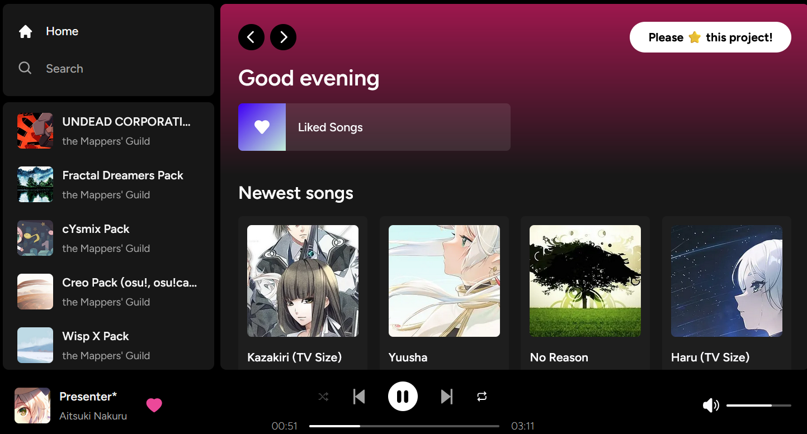

# Osutify

## Description

Osutify is a project that aims to create a music player specifically designed for the game osu!. It provides features such as song playback, playlist management, and integration with the osu! game client.

## 🌻 Live Demo

A live demo of the application is available at [osutify.vercel.app](https://osutify.vercel.app/).

## Features

- Up-to-date song library from osu! and mirror servers
- Song playback with progress bar and controls
- Liked playlist with favorite songs

## Installation

1. Clone the repository: `git clone https://github.com/richardscull/osutify`
2. Install the required dependencies: `npm install`
3. Start the application: `npm start`

## License

This project is licensed under the MIT License. See the [LICENSE](LICENSE) file for more details.